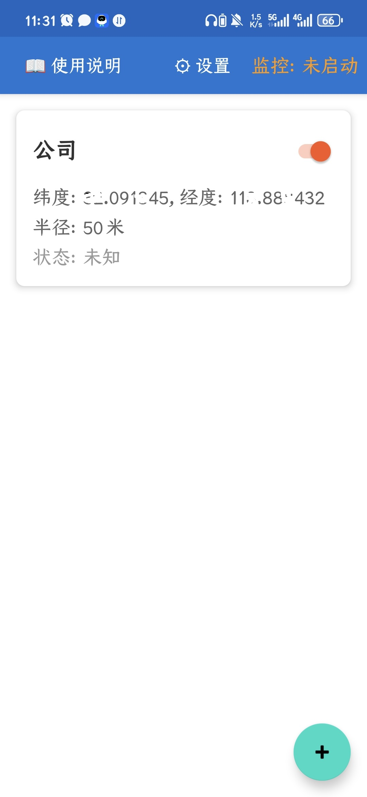
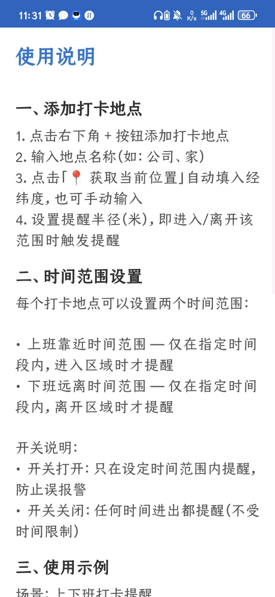
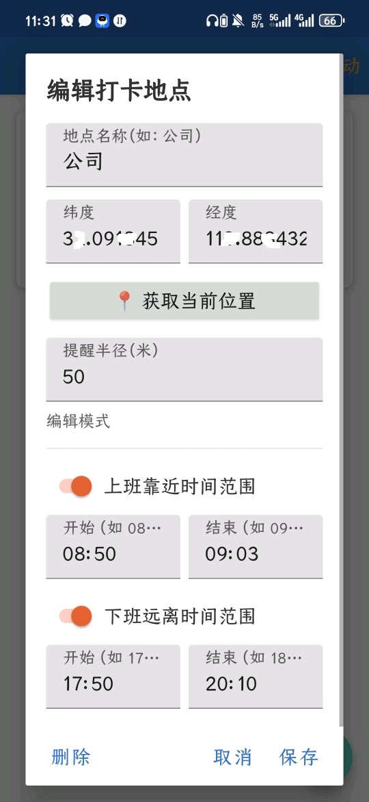
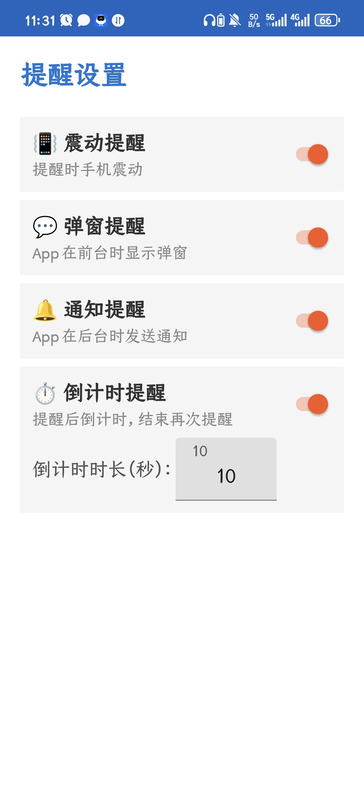

# 忘打卡

> 基于 GPS 地理围栏的打卡提醒应用，防止上下班忘记打卡。

当用户靠近或远离指定坐标一定距离时，通过弹窗或通知提醒打卡。即使 App 关闭，后台也能持续监控位置变化。

## 📱 应用截图

<div align="center">
  <table>
    <tr>
      <td></td>
      <td></td>
    </tr>
    <tr>
      <td align="center"><b>主界面</b></td>
      <td align="center"><b>使用说明</b></td>
    </tr>
    <tr>
      <td></td>
      <td></td>
    </tr>
    <tr>
      <td align="center"><b>新增打卡点</b></td>
      <td align="center"><b>设置</b></td>
    </tr>
  </table>
</div>

## ✨ 功能

- **打卡地点管理**：添加、编辑、删除打卡地点，支持启用/禁用开关
- **GPS 定位**：自动获取当前位置，也可手动输入经纬度
- **地理围栏提醒**：进入/离开指定半径范围时自动提醒
- **后台持续监控**：前台服务运行，手机重启后自动启动
- **上下班时间范围**：可设置提醒生效的时间段，防止误报
- **灵活提醒方式**：震动、弹窗、通知、倒计时（可配置）
- **设置页面**：自由开关提醒方式，自定义倒计时时长

## 🔧 技术栈

- **语言**：Java
- **构建工具**：Gradle 8.9 / Android Gradle Plugin 8.7.2
- **构建环境**：Docker (`mingc/android-build-box:latest`)
- **最低 SDK**：21 (Android 5.0)
- **目标 SDK**：34 (Android 14)
- **编译 SDK**：34
- **包名**：`com.example.helloworld`
- **UI**：RecyclerView + CardView + Material Components
- **数据库**：Room (SQLite)
- **主题**：MaterialComponents Light NoActionBar

## 📦 项目结构

```
app/src/main/
├── AndroidManifest.xml
├── java/com/example/helloworld/
│   ├── MainActivity.java             # 主界面：打卡地点列表 + 服务控制
│   ├── HelpActivity.java             # 使用说明页面
│   ├── SettingsActivity.java         # 设置页面：震动/弹窗/通知/倒计时开关
│   ├── CheckInLocation.java          # 打卡地点数据模型
│   ├── CheckInLocationAdapter.java   # RecyclerView 适配器
│   ├── CheckInLocationEntity.java    # Room 实体
│   ├── CheckInLocationDao.java       # Room DAO
│   ├── AppDatabase.java              # Room 数据库
│   ├── LocationMonitorService.java   # 前台位置监控服务
│   └── BootReceiver.java             # 开机自启动广播接收器
└── res/
    ├── layout/
    │   ├── activity_main.xml           # 主界面布局
    │   ├── activity_help.xml           # 使用说明布局
    │   ├── activity_settings.xml       # 设置页面布局
    │   ├── item_checkin_location.xml   # 打卡地点列表项
    │   └── dialog_add_location.xml     # 添加/编辑打卡点对话框
    └── values/
        ├── strings.xml
        ├── colors.xml
        └── themes.xml
```

## 🏗 构建

### 使用构建脚本（推荐）

```bash
# Debug APK
./build.sh

# Release APK
./build.sh release

# 清理 + Debug
./build.sh clean
```

### 使用 Docker 手动构建

```bash
# Debug APK
docker run --rm -v "$(pwd)":/project -v "$(pwd)/gradle-8.9":/opt/gradle-8.9 \
  mingc/android-build-box:latest /bin/bash -c "
    export GRADLE_HOME=/opt/gradle-8.9 && export PATH=\$GRADLE_HOME/bin:\$PATH
    cd /project && gradle assembleDebug
  "

# Release APK
docker run --rm -v "$(pwd)":/project -v "$(pwd)/gradle-8.9":/opt/gradle-8.9 \
  mingc/android-build-box:latest /bin/bash -c "
    export GRADLE_HOME=/opt/gradle-8.9 && export PATH=\$GRADLE_HOME/bin:\$PATH
    cd /project && gradle assembleRelease
  "
```

编译产物：
- Debug APK：`app/build/outputs/apk/debug/app-debug.apk`
- Release APK：`app/build/outputs/apk/release/app-release.apk`

> **注意**：`build.gradle` 中的签名密钥配置（`my-release-key.jks`）不应提交到版本控制系统。

## 📋 权限

| 权限 | 用途 |
|------|------|
| `ACCESS_FINE_LOCATION` | 精确 GPS 定位 |
| `ACCESS_COARSE_LOCATION` | 粗略定位（fallback） |
| `ACCESS_BACKGROUND_LOCATION` | 后台位置监控（Android 10+） |
| `SYSTEM_ALERT_WINDOW` | 后台服务弹出提醒对话框 |
| `POST_NOTIFICATIONS` | 发送通知栏提醒（Android 13+） |
| `FOREGROUND_SERVICE` | 前台位置监控服务 |
| `FOREGROUND_SERVICE_LOCATION` | 前台服务使用位置信息 |
| `RECEIVE_BOOT_COMPLETED` | 开机自启动监控服务 |
| `VIBRATE` | 提醒时震动设备 |

## 📄 许可证

本项目仅供学习参考使用。
